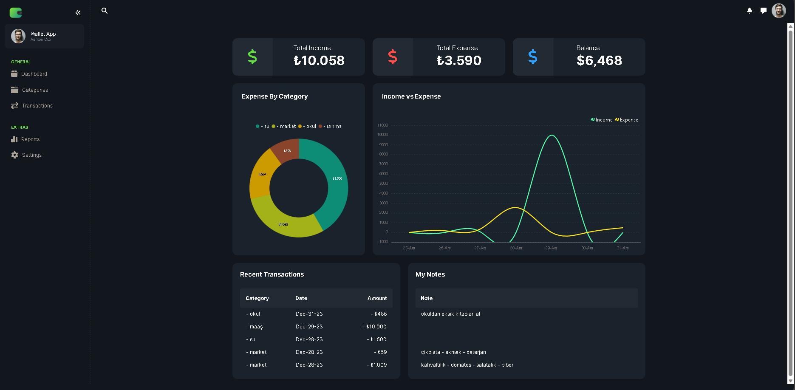
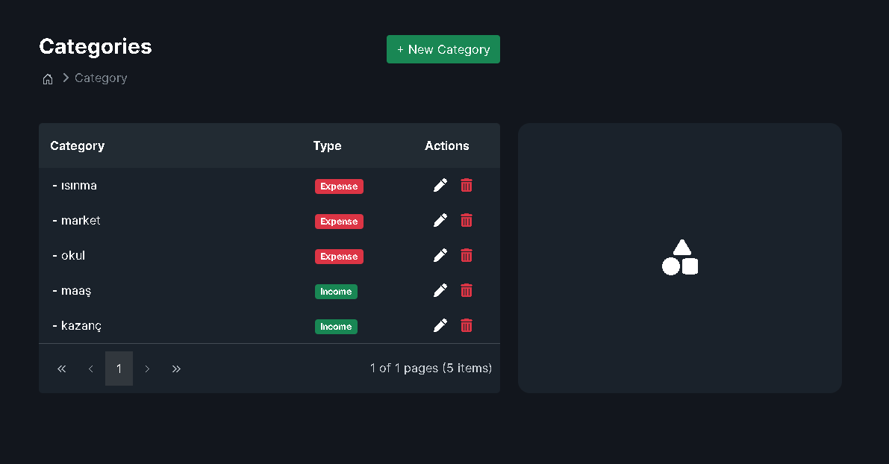
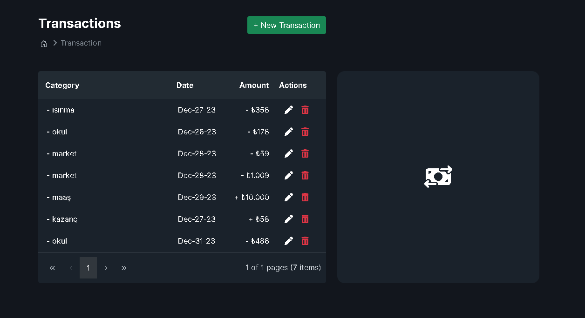
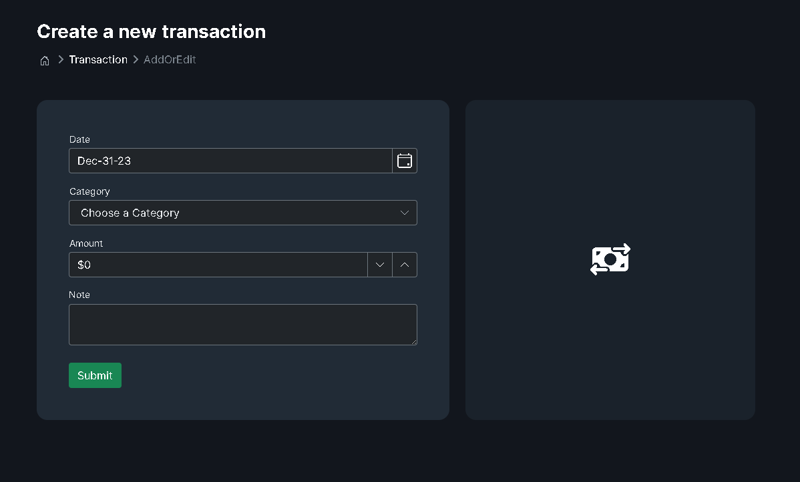

# Expense-Tracker-App-in-Asp.Net-Core-MVC
This is an Expense Tracker App in Asp.Net Core MVC using SyncFusion Components.

This is a complete Asp.Net Core application to demonstrate the building an enterprise application from scratch.

Discussed Points :
Implemented CRUD Operation of Category & Transaction
Grid with Paging & Sorting
Dashboard with Chart Elements
Side Menu within Dockable Side Bar
Etc.

 ## How it works ?
 
# Main page

# Category Page 

# Add New Category Page

# Transaction Page

# Add New Transaction Page
